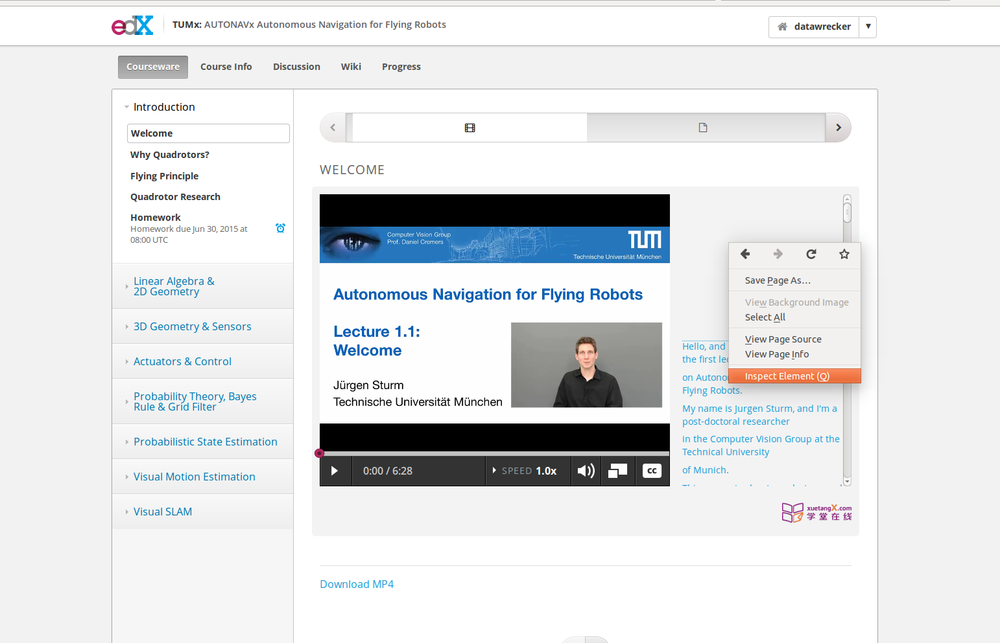
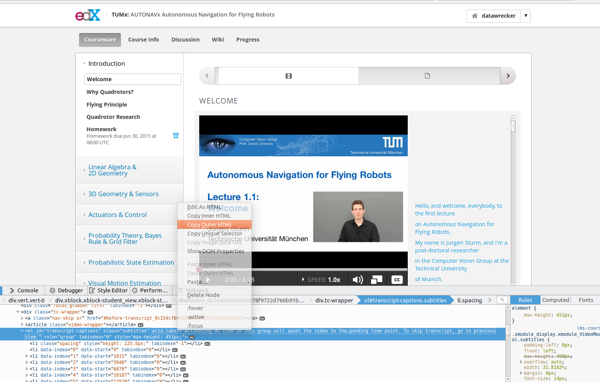

## How to extract and generate subtitles (srt) for some edX online courses

Some edX online courses only provide online subtitles. It's inconvient for those who want to watch the video clips offline, especially non-native English speakers. So here is a way to extract sentences from the online subtitles to generate srt files for offline using. I'm only using Firefox as the example here, but should be no much difference to other mainstream web browsers.

1. Assuming that you have opened the webpage where the video clip of the online course is showing, now move your mouse to the subtitle area and right click it, from the popup menu, choose the "Inspect Element" item.

2. An "Inspector" sub-window will show up from the bottom. All the subtitles are in an "ol" element, each sentence showing at a time is a "li" element. So in the "Inspector" subwindow, right click the "ol" element, from the popup menue, choose the "Copy Outer HTML" item, then save the copied content into a text file, say, "lecture1.1.html."

3. Invoke the program "html_to_srt.py" to extract sentences from the html file and generate the final srt file.

    `$ python html_to_srt.py`
